# C version of feature extractor

------------------------------

## Libraries:
I have used only one library for implementing, and one for testing on this version. 
- [EIGEN](https://gitlab.com/libeigen/eigen) : Basic matrix storage and manipulation.
- [CATCHTEST](https://github.com/catchorg/Catch2) : C++ Testing framework.

---------------------
## Testing:
- I used unit test for some common cases such as horizontal line, vertical line, cubic line,...
- I manually tested for another cases by verifying my results on [BEZIER DEMO](https://www.desmos.com/calculator/cahqdxeshd).
- It also can be used for multiple bezier curves by splitting it into small parts.
## Testcases:
I tested this implementation by using some Generate points of character from 0 to 9.
### Testcase 0:
- Original points
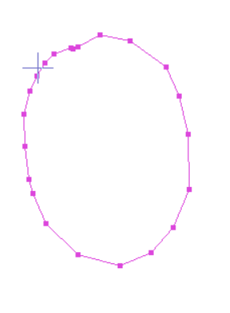
- Generate curves
<table>
<tr>
<td>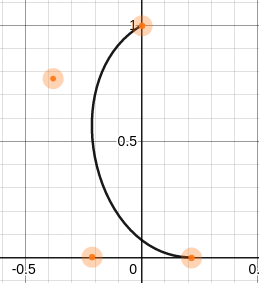</td>
<td>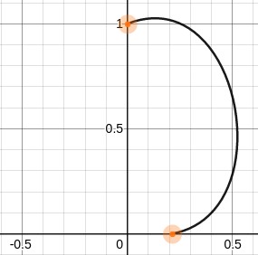</td>
</tr>
</table>

### Testcase 1:
- Original points
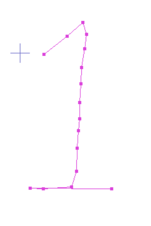
- Generate curves
<table>
<tr>
<td>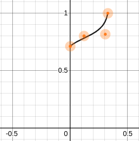</td>
<td>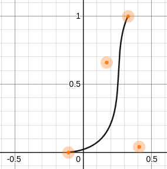</td>
<td>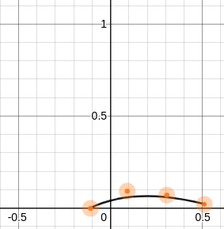</td>
</tr>
</table>

### Testcase 2:
- Original points
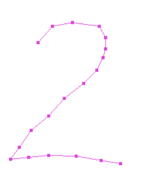
- Generate curves
<table>
<tr>
<td>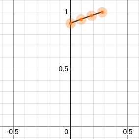</td>
<td>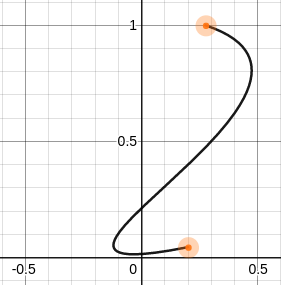</td>
<td>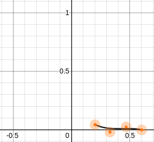</td>
</tr>
</table>

### Testcase 3:
- Original points
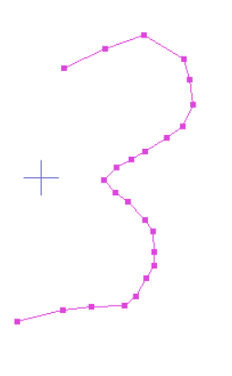
- Generate curves
<table>
<tr>
<td>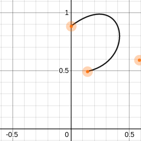</td>
<td>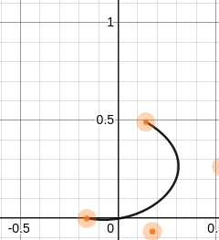</td>
</tr>
</table>

### Testcase 4:
- Original points
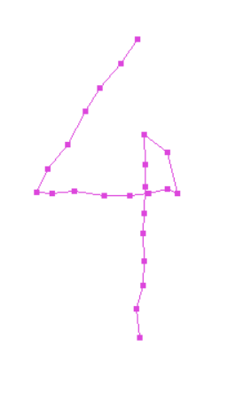
- Generate curves
<table>
<tr>
<td>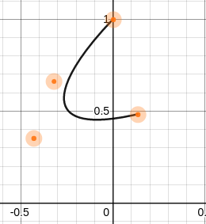</td>
<td>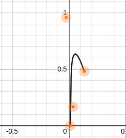</td>
</tr>
</table>

### Testcase 5:
- Original points
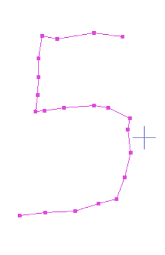
- Generate curves
<table>
<tr>
<td>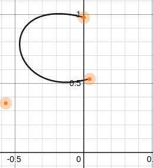</td>
<td>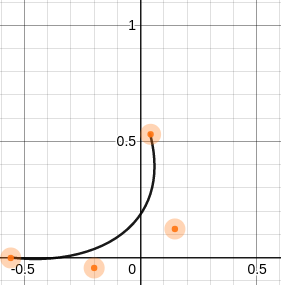</td>
</tr>
</table>

### Testcase 6:
- Original points
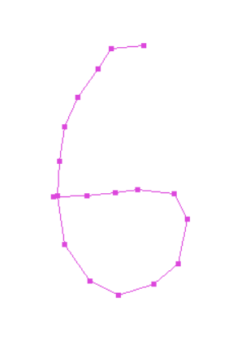
- Generate curves
<table>
<tr>
<td>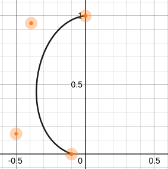</td>
<td>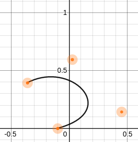</td>
</tr>
</table>

### Testcase 7:
- Original points
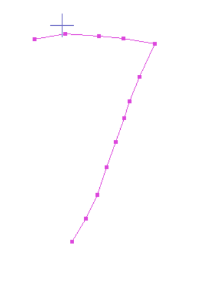
- Generate curves
<table>
<tr>
<td>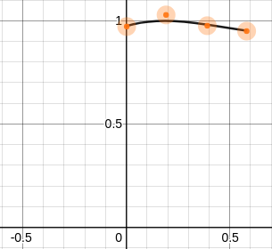</td>
<td>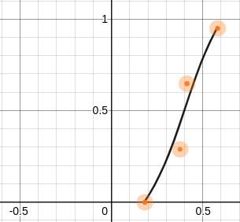</td>
</tr>
</table>

### Testcase 8:
- Original points
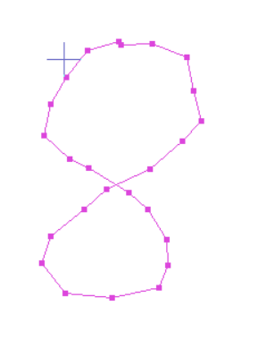
- Generate curves
<table>
<tr>
<td>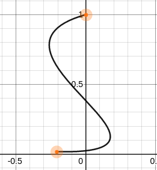</td>
<td>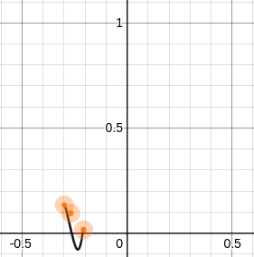</td>
<td>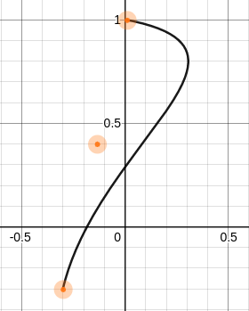</td>
</tr>
</table>

### Testcase 9:
- Original points
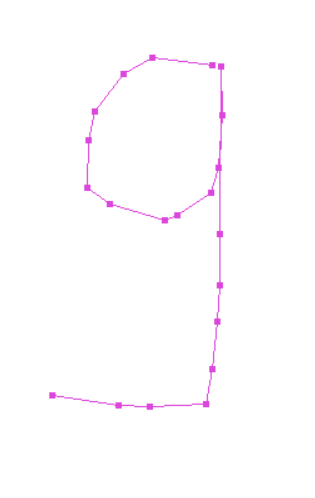
- Generate curves
<table>
<tr>
<td>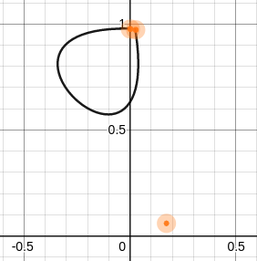</td>
<td>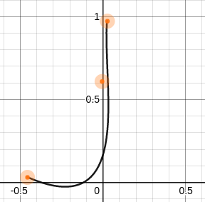</td>
</tr>
</table>

### Testcase 10:
- Original points
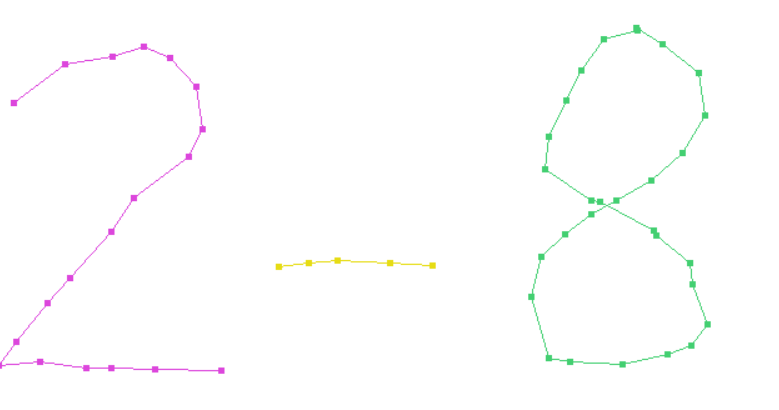
- Generate 10 curves (with additional off stroke points), and 6 curves (without off stroke points)

### Testcase 11:
- Original points
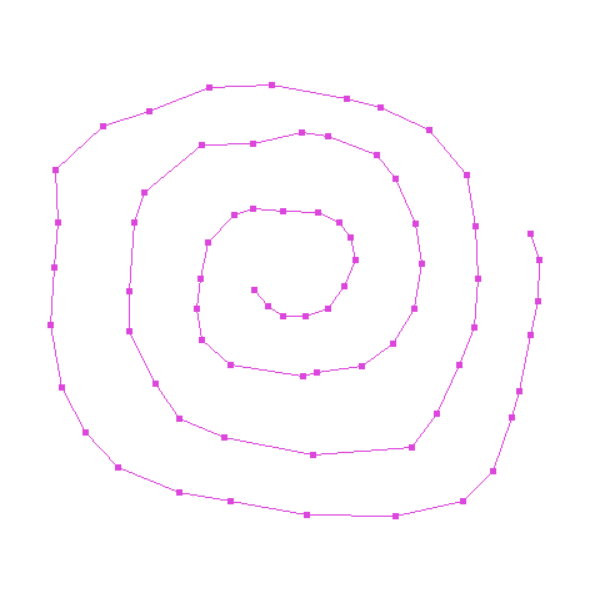
- Generate 9 curves

### Testcase 12:
- Original points
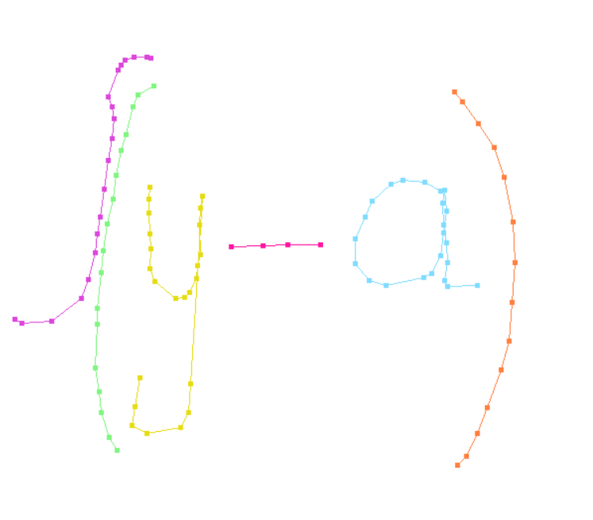
- Generate 12 curves

### Testcase 13:
- Original points
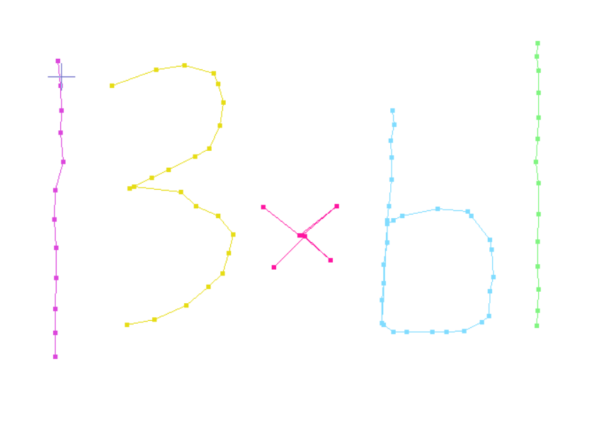
- Generate 13  curves

### Testcase 14:
- Original points
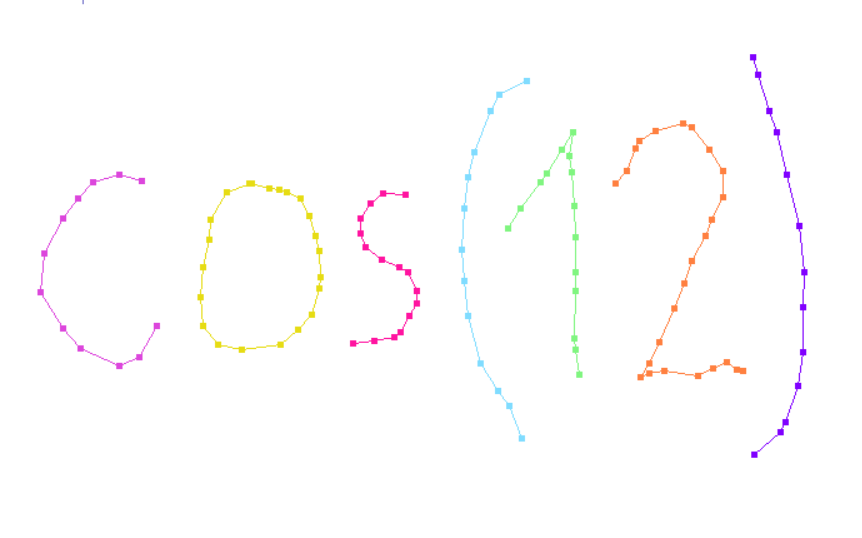
- Generate 17 curves